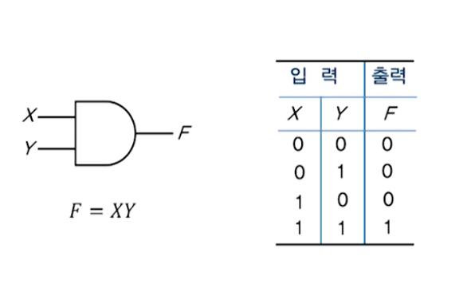
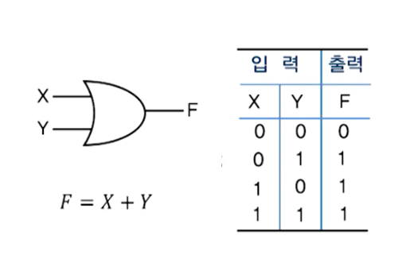
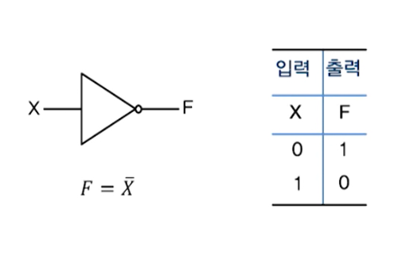
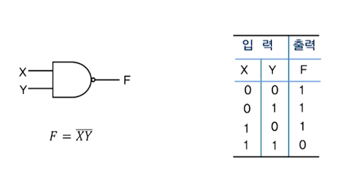
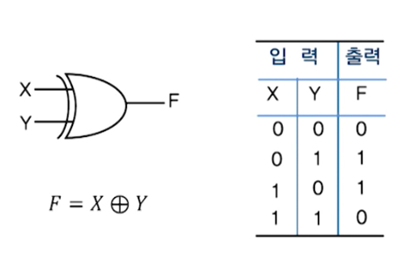
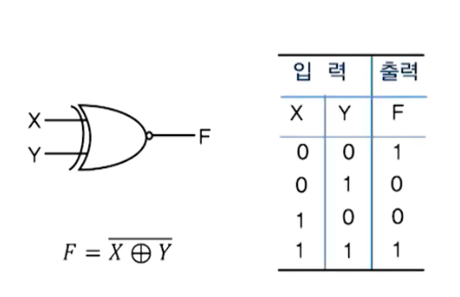
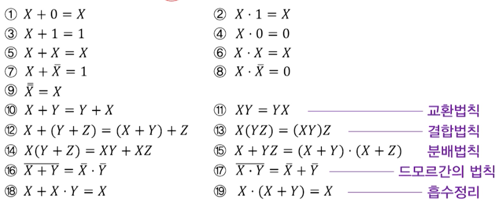

# 디지털논리회로

- [디지털논리회로](#디지털논리회로)
  - [디지털 시스템의 설계](#디지털-시스템의-설계)
  - [디지털논리회로란?](#디지털논리회로란)
  - [컴퓨터 하드웨어 구성](#컴퓨터-하드웨어-구성)
  - [집적회로](#집적회로)
  - [집적도(level of integration)](#집적도level-of-integration)
  - [보수(=보충수)](#보수보충수)
  - [보수를 이용한 감산](#보수를-이용한-감산)
  - [영숫자 코드(영문자와 숫자를 2진 코드로 표현)](#영숫자-코드영문자와-숫자를-2진-코드로-표현)
  - [논리연산과 논리 집합](#논리연산과-논리-집합)
  - [논리게이트](#논리게이트)
    - [AND](#and)
    - [OR](#or)
    - [NOT](#not)
    - [NAND](#nand)
    - [NOR](#nor)
    - [XOR](#xor)
    - [XNOR](#xnor)
  - [부울대수(Boolean Algebra)](#부울대수boolean-algebra)
    - [부울대수의 기본 공식](#부울대수의-기본-공식)
    - [부울대수 쌍대성 원리(principle of duality)](#부울대수-쌍대성-원리principle-of-duality)
    - [드모르간 정리](#드모르간-정리)
  - [부울함수(Boolean Function)](#부울함수boolean-function)
    - [부울함수의 정규형](#부울함수의-정규형)
    - [부울함수의 표준형](#부울함수의-표준형)
  - [조합논리회로, 순서논리회로](#조합논리회로-순서논리회로)
    - [조합논리회로 설계](#조합논리회로-설계)
  - [기본 연산회로](#기본-연산회로)
    - [가산기(adder)](#가산기adder)
  - [부울대수](#부울대수)
    - [쌍대성 원리(principle of duality)](#쌍대성-원리principle-of-duality)

## 디지털 시스템의 설계

1. 회로 설계(circuit design) 단계
   - 능동소자와 수동소자를 연결시키는 단계
2. 논리 설계(logic design) 단계
   - 논리회로를 만들기 위해 논리소자들을 연결시키는 단계
3. 시스템 설계(system design) 단계
   - 논리회로들을 연결하여 프로세서, 입출력 제어장치 등을 설계하는 단계
4. 실제적 설계(physical design) 단계
   - 시스템 설계단계의 부품들을 PCB나 와이어 랩 기판에 배치시키는 단계

## 디지털논리회로란?

- 2진 디지털 논리를 `논리 게이트(logic gate)`로 구현한 것
- 디지털 시스템을 구현하는 기본 요소
- 디지털 시스템의 논리설계(logic design) 단계에서 설계됨

- `조합논리회로` : 저장 요소가 없음(ex: 가산기, 디코더 등)
- `순서논리회로` : 저장 요소가 있음(ex: 레지스터, 카운터 등)

## 컴퓨터 하드웨어 구성

1. 입력장치
   - 외부로부터 데이터를 입력
2. 기억장치
   - 데이터를 기억하고 저장
3. 연산장치
   - 데이터에 대한 산술, 논리연산을 수행
4. 제어장치
   - 데이터 처리를 위한 구성요소들을 제어
5. 출력장치
   - 처리된 결과를 외부로 출력

## 집적회로

- 디지털회로는 집적회로로 구성된다.
- 집적회로(IC: Integrated Circuits)
  - 디지털 게이트의 기능을 수행하는 전자소자를 포함한 작은 실리콘 반도체 크리스탈(silicon semiconductor crystal)
  - 칩(chip)이라고 함
  - 칩 내부에 있는 여러가지 게이트들은 회로의 목적에 부합되도록 상호 연결되어있음

## 집적도(level of integration)

- 단위 실리콘 칩에 집적할 수 있는 게이트의 수
- `소규모 집적`(SSI: Small Scale Integration) : 몇 개의 독립된 게이트를 내장
- `중규모 집적`(MSI: Medium Scale Integration) : 대략 10~100여 개의 게이트를 내장(`디코더`, `레지스터`)
- `대규모 집적`(LSI: Large Scale Integration) : 수백~수천 개의 게이트를 내장(`프로세서`, `기억장치 칩`)
- `초대규모 집적`(VLSI: Very Large Scale Integration) : 수천 개 이상의 게이트를 내장(`마이크로컴퓨터 칩`)

## 보수(=보충수)

현재값에서 어떤 값을 더해야 모든 자리 수가 꽉 채워지는가?

- r의 보수(정수 부분이 n자리 일때)
- N에 대한 r의 보수 = `r^n - N` (N!=0) or `0` (N==0)

- (r-1)의 보수(정수 부분이 n자리, 소수 부분이 m자리 일 때)
- N에 대한 (r-1)의 보수 = `r^n - r^(-m) - N`

- `r의 보수` = (r-1)의 보수 + 가장 낮은 자리의 1

## 보수를 이용한 감산

- 보수를 이용하면 이진 시스템에서 감산(뺄셈)을 수행할 수 있다.
- 감산과 가산의 논리회로가 거의 유사한 구조를 가져 보수 개념을 이용해 한 논리회로로 감산과 가산을 수행하게된다.
- 아래 예시를 통해 보수를 이용해 어떻게 감산을 할지 이해해보자

`923 - 678` = `245`
`923 + 322`(678의 보수) = 1`245` -> 여기서 올림수 1을 무시하면 `245`가 됨

## 영숫자 코드(영문자와 숫자를 2진 코드로 표현)

- ASCII 코드
  - ASCII(American Standard Code for Information Interchange)
  - 하나의 영숫자 코드가 `7비트`로 구성, 전체 수는 128(2^7)개
  - 실제 사용될 때는 1비트의 `패리티 비트`를 포함하여 전송
- EBCDIC 코드
  - EBCDIC(Extended Binary Coded Decimal Interchange)
  - 하나의 영수자 코드가 8비트로 구성
  - 1비트의 패리티 비트를 포함하여 전송하면 9비트가 되어 비효율적
- 유니코드
  - 일부 문자를 표현하지 못하던 ASCII코드의 한계점을 극복하고, 전 서계 문자체계를 표현
  - 1995년 ISO/IEC JTC1에서 국제표준 제정
  - 인코딩 방식으로 UTF-8, UTF-16, UTF-32의 세가지가 있음

## 논리연산과 논리 집합

- 논리집합(부울집합)
  - 집합이 0(거짓)과 (1)참으로만 구성된 집합 {0, 1}
- 논리연산(부울연산)
  - 두 개의 이산값에 적용되는 연산

## 논리게이트

### AND

- 두 입력값(X, Y)이 `X=Y=1`라면 1, 아니면 0을 출력

### OR

- 두 입력값(X, Y)이 `X+Y>=1`라면 1, 아니면 0을 출력

### NOT

- 입력값(X)이 0이면 1을, 1이면 0을 출력

### NAND

- AND 연산 이후 NOT 연산의 결과값 출력

### NOR

- OR 연산 이후 NOT 연산의 결과값 출력

### XOR

- X(exclusive) : 이전연산의 결과값이 1과 일치하면 1 아니면 0을 출력
- OR 연산 결과값이 1과 일치하면 1, 아니면 0을 출력

### XNOR

- NOR 연산 결과값이 1과 일치하면 1, 아니면 0을 출력

## 부울대수(Boolean Algebra)

- 0과 1의 값을 갖는 논리변수와 논리연산을 다루는 대수

### 부울대수의 기본 공식

### 부울대수 쌍대성 원리(principle of duality)

- 부울대수에서 어떤 부울공식이 항상 성립하고 자신의 쌍대형태를 구할 수 있다면 그 쌍대형태의 부울식도 성립한다.
- 쌍대형태 : 논리연산자 +와 ' 그리고 논리상수 1과 0을 맞바꾼 상태

### 드모르간 정리

- 드모르간 정의를 이용하면 부울함수의 보수를 쉽게 구할 수 있다.
- 쌍대를 구하고(AND <-> OR, 0 <-> 1), 각 변수의 보수를 취한다

## 부울함수(Boolean Function)

- 논리변수의 상호관계를 나타내기 위해 부울변수, 부울연산기호, 괄호 및 등호 등으로 나타내는 대수적인 표현

### 부울함수의 정규형

- 부울함수를 `최소항의 합`이나 `최대항의 곱`으로 표현한 것
- `최소항` : 2개의 논리변수 X, Y가 있을 때 논리곱(AND)으로 표현되는 항 중에서 그 결과는 논리-1을 갖는 항, m1,,, mi로 표현
- `최대항` : 2개의 논리변수 X, Y가 있을 때 논리합(OR)으로 표현되는 항 중에서 그 결과는 논리-0을 갖는 항, M1,,, Mi로 표현

### 부울함수의 표준형

- 부울함수를 표현하는 또 다른 형태(간소화된 형태)
- 각 항은 하나 또는 그 이상의 문자로 구성
- `곱의 합`과 `합의 곱`의 형태
- 정규형은 진리표에서 바로 얻을 수 있찌만, 최소항 또는 최대항에 모든 변수가 포함되어 있어 부울함수의 간소화에 부적합
- 따라서 정규형으로서 간소화된 표준형으로 변환 필요

## 조합논리회로, 순서논리회로

- `조합논리회로` : 현재의 입력에 의해서만 출력이 결정되는 논리회로
- 조합논리회로의 분석은 `부울함수 유도` 혹은 `진리표`를 이용한다
- `순서논리회로` : 조합논리회로에 저장요소를 추가한 회로. 별도의 상태를 관리하는 `저장요소`가 있고 `저장요소`의 상태와 입력 변수에 의해서 출력이 결정됨
- 저장요소는 `F/F(Flip-Flop)`이라는 용어로 불리기도 함

### 조합논리회로 설계

1. 입출력 관계를 이해(e.g. x,y,z 입력이 3개이고 출력이 3개이다)
2. 진리표 작성(입출력 관계 구체적 가시화)
3. 출력 부울함수 유도
4. 유도된 부울함수를 기준으로 논리회로도 작성

## 기본 연산회로

- 가,감,승,제의 산술연산회로
- 가산기: 덧셈회로
- 감산기: 뺄셈회로
- 승산기: 곱셈회로
- 제산기: 나눗셈회로

### 가산기(adder)

- 2진수의 덧셈을 수행하는 조합논리회로
- `반가산기`(HA: Half Adder): 두 비트의 덧셈을 수행
- `전가산기`(FA: Full Adder): 세 비트의 덧셈을 수행

## 부울대수

- 부울값(0 또는 1) 또는 부울값을 가지는 부울변수에 대한 논리연산을 다루는 수학
- 부울대수에서 사용되는 논리연산은 피연산자의 개수에 따라 이항연산자와 단항연산자로 나뉨

### 쌍대성 원리(principle of duality)

- 부울식에서 논리곱과 논리합을 서로 바꾸고 논리상수 0과 1을 서로 바꾸면 원래 부울식의 `쌍대(dual)`를 얻게 됨
- 주어진 부울식과 그것의 쌍대는 **진리값이 서로 같음**
